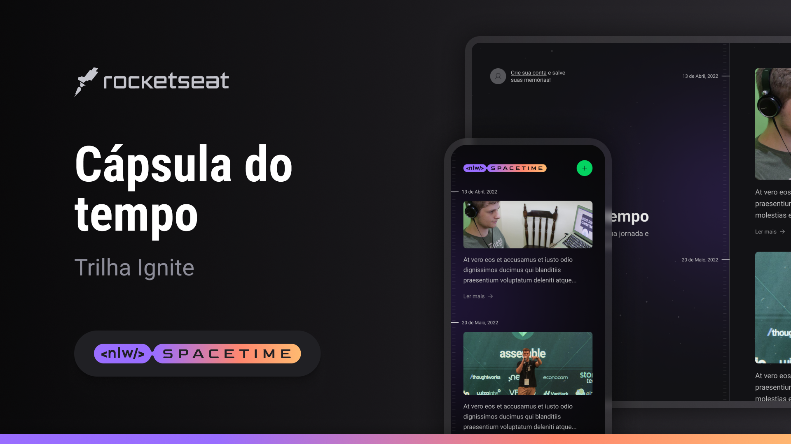

<!-- markdownlint-disable MD033 -->
<!-- markdownlint-disable MD041 -->
<!-- markdownlint-disable MD051 -->

<div align="center">
  
</div>
<br>
<div align="center">
  <a href="https://github.com/mgckaled">
    
  </a>
  
  
  
</div>
<br>
<div align="center">
  <a>
    
    
    
    
    
    
    
    
    
  <a/>
</div>

# `NLW Spacetime - 12° edição`

<div align="center">

[**Sobre o Projeto**](#🪐-sobre-o-projeto) &nbsp;&nbsp;&#124;&nbsp;&nbsp;
[**Deploy**](#🖥️-deploy) &nbsp;&nbsp;&#124;&nbsp;&nbsp;
[**Tecnologias**](#🚀-tecnologias) &nbsp;&nbsp;&#124;&nbsp;&nbsp;
[**Layout**](#🔖-layout) &nbsp;&nbsp;&#124;&nbsp;&nbsp;
[**Configurações**](#💻-configurações) &nbsp;&nbsp;&#124;&nbsp;&nbsp;
[**Licença**](#📝-licença)

</div>

<p align="center">
  
</p>

## 🪐 Sobre o Projeto

`<nlw/> Spacetime` é um projeto desenvolvido durante **Next Level Week**,  evento online produzido pela [**Rocketseat**](https://www.rocketseat.com.br/).

## 🖥️ Deploy

Indisponível.

## 🚀 Tecnologias

<table>
  <tbody>
    <tr>
      <td style="font-weight: bold"><code>/template</code></td>
      <td>
        <a href="https://developer.mozilla.org/pt-BR/docs/Web/HTML" target="_blank" rel="noopener noreferrer"><code>HTML</code></a> -
        <a href="https://developer.mozilla.org/pt-BR/docs/Web/CSS" target="_blank" rel="noopener noreferrer"><code>CSS</code></a> -
        <a href="https://developer.mozilla.org/pt-BR/docs/Web/JavaScript" target="_blank" rel="noopener noreferrer"><code>Javascript</code></a>
      </td>
    <tr>
      <td style="font-weight: bold"><code>back-end (/server)</code></td>
      <td>
        <a href="https://nodejs.org/en/" target="_blank" rel="noopener noreferrer"><code>Node.JS</code></a> -
        <a href="https://www.typescriptlang.org/" target="_blank" rel="noopener noreferrer"><code>Typescript</code></a> -
        <a href="https://www.fastify.io/" target="_blank" rel="noopener noreferrer"><code>Fastify</code></a> -
        <a href="https://www.prisma.io/" target="_blank" rel="noopener noreferrer"><code>Prisma</code></a> -
        <a href="https://www.sqlite.org/index.html" target="_blank" rel="noopener noreferrer"><code>SQLite</code></a>
      </td>
    </tr>
    <tr>
      <td style="font-weight: bold"><code>front-end (/web)</code></td>
      <td>
        <a href="https://reactjs.org/" target="_blank" rel="noopener noreferrer"><code>React</code></a> -
        <a href="https://www.typescriptlang.org/" target="_blank" rel="noopener noreferrer"><code>TypeScript</code></a> -
        <a href="https://nextjs.org/" target="_blank" rel="noopener noreferrer"><code>NextJS</code></a> -
        <a href="https://tailwindcss.com/" target="_blank" rel="noopener noreferrer"><code>TailwindCSS</code></a>
      </td>
    </tr>
    <tr>
      <td style="font-weight: bold"><code>/mobile</code></td>
      <td>
        <a href="https://reactnative.dev/" target="_blank" rel="noopener noreferrer"><code>React Native</code></a> -
        <a href="https://expo.dev/" target="_blank" rel="noopener noreferrer"><code>Expo</code></a> -
        <a href="https://www.nativewind.dev/" target="_blank" rel="noopener noreferrer"><code>NativeWind</code></a>
      </td>
    </tr>
  </tbody>
</table>

<br>

## 🔖 Layout

- [`Trilha IGNITE`](https://www.figma.com/community/file/1240070456276424762)

- [`Trilha DISCOVER`](https://www.figma.com/community/file/1240071097028170811)

É necessário ter conta no [Figma](https://figma.com) para acessar os layouts.

## 💻 Configurações

### Requisitos

Necessário realizar as instalações:

- [`Git`](https://git-scm.com/)
- [`npm`](https://www.npmjs.com/)
- [`Node`](https://nodejs.org/)
- [`Expo`](https://docs.expo.dev/)
- [`Expo Go`](https://expo.dev/client)

Criar conta e configurar os serviços externos:

- [`GitHub`](https://github.com/)
- [`Expo`](https://expo.dev/)

### Clonar repositório

```bash
# Execute o comando git clone para realizar o clone do repositório
$ git clone https://github.com/mgkclaed/nlw12-spacetime.git
# ou execute (necessário instalar Github CLI - https://cli.github.com/)
$ gh repo clone mgckaled/nlw12-spacetime
# Entre na pasta do repositório clonado
$ cd nlw12-spacetime
```

### Comandos importantes

#### `/server`

```bash
# instalar dependências
$ npm i
# iniciar servidor
$ npm rum dev
# setup prisma com flag SQLite - schema prisma file / .env
$ npx prisma init --datasource-provider SQLite
# migration - mecanismo de versionamento de banco de dados (arquivos de instruções)
$ npx prisma migrate dev
# visualisar banco de dados - Prisma Studio
$ npx prisma studio
# Gerar ERD - Diagrama de Banco de Dados
$ npx prisma generate
# Gerar seed (exemplo) para Banco de Dados. Observar configurações do prisma no package.json
$ npx prisma db seed
```

#### `/web`

```bash
# instalar dependências
$ npm i
# iniciar servidor
$ npm rum dev
```

### `/mobile`

```bash
## instalar dependências
$ npm i
# inicializar expo (ambiente de desenvolvimento)
$ npx expo start
```

```bash
# após criar uma conta no Expo, faça login pelo terminal:
$ npx expo login
# ao confirmar seu nome e senha, o terminal deverá mostrar o nome do usuário:
$ npx expo whoami
```

## 📝 Licença

Esse projeto está registrado sob a licença MIT.

---

Feito com ❤️ by Marcel Kaled
